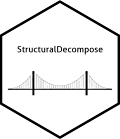

# StructuralDecompose



<!-- badges: start -->

[](https://CRAN.R-project.org/package=StructuralDecompose)

<!-- badges: end -->

**Note:** Website documentation is still under construction.

**StructuralDecompose** is an algorithm suited to the decomposition of a time series into its component terms of trend, seasonality, and residuals. It is well suited to decompose a series in the presence of significant level shifts.

The algorithm outputs the decomposed trend, seasonality, residuals, as well as anomalies detected.

## Installation

The `StructuralDecompose` package is now available on CRAN.

You can install it like so:

| Type        | Source | Command                                                     |
|-------------|--------|-------------------------------------------------------------|
| Release     | CRAN   | `install.packages("StructuralDecompose")`                  |
| Development | GitHub | `devtools::install_github("StructuralDecompose/StructuralDecompose")` |

Once installed, load the package using:

```r
library(StructuralDecompose)
```
