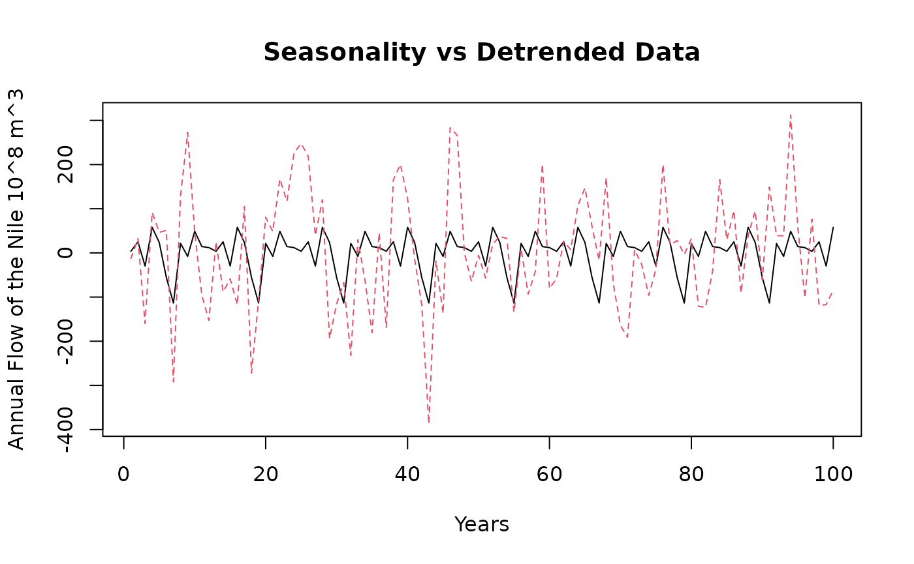

# Example-Walkthrough

## Introduction

In this example, we will go through the various features of
StructuralDecompose. We will trace it’s behavior with the popular ‘Nile
Dataset’ that tracks the annual flow of the Nile river. This dataset has
a single break-point in the series. We will test our algorithm against
other common trend fitting algorithms as well.

## Getting Started

StructuralDecompose primarily relies on ‘Strucchange’ and ‘changepoints’
for the detection of breakpoints. Other packages will be added soon.
Currently the smoothening algorithm defaults to loess, but we will add
further smoothening algorithms in the future.

``` r

suppressMessages(suppressWarnings(library(changepoint)))
suppressMessages(suppressWarnings(library(strucchange)))
```

## Loading the Data

To read the data we can use the simple:

``` r

data <- StructuralDecompose::Nile_dataset[,1]
```

Let’s see the movement of the data over time

``` r

matplot(data, type = 'l', xlab = 'Years', ylab = 'Annual Flow of the Nile (10^8 m^3')
```


There is a sudden level shift within the data, let’s see decompose with
simple stl and see how well the data movement is captured.

``` r

data <- StructuralDecompose::Nile_dataset[,1]

data <- ts(data = as.vector(t(data)), frequency = 12)

decomposed <- stl(data, s.window = 'periodic')

seasonal <- decomposed$time.series[,1]
trend <- decomposed$time.series[,2]
remainder <- decomposed$time.series[,3]
```

## Decomposition

Let’s decompose the time series into parts and observe it’s behavior

``` r

plot(cbind(seasonal, remainder, trend), type = 'l', main = 'Decomposed Series')
```


As we can see the trend over explains the time series and we do not see
the average movement of the series

``` r

matplot(cbind(trend, data), type = 'l', xlab = 'Years', ylab = 'Annual Flow of the Nile (10^8 m^3', main = 'Trend vs Base Data')
```


Let’s now check simple smoothening with lowess

``` r

Trend <- lowess(data)$y
matplot(cbind(Trend, data), type = 'l', xlab = 'Years', ylab = 'Annual Flow of the Nile (10^8 m^3', main = 'Smoothened Trend vs Base Data')
```


As we can see, it does not do a great job of identifying that
significant level shift, it smoothens the entire series at once.

Let’s see it’s behavior with StructuralDecompose

``` r


Results <- StructuralDecompose::StructuralDecompose(Data = data)
  
matplot(cbind(Results$trend_line, data), type = 'l', xlab = 'Years', ylab = 'Annual Flow of the Nile (10^8 m^3', main = 'New Trend vs Base Data')
```


As we can see, the algorithm treats the series as two separate time
series, and smoothens each one. This delivers a superior decomposition.

Let’s see the other components of seasonality and the remainder.

``` r

matplot(cbind(as.numeric(Results$seasonality), c(data - Results$trend_line)), type = 'l', xlab = 'Years', ylab = 'Annual Flow of the Nile 10^8 m^3',main = 'Seasonality vs Detrended Data')
```



As we can see the behavior of seasonality is much better now, let’s
compare it with the older series

``` r

matplot(cbind(as.numeric(seasonal), c(data - trend)), type = 'l', xlab = 'Years', ylab = 'Annual Flow of the Nile 10^8 m^3',main = 'Seasonality vs Detrended Data')
```


